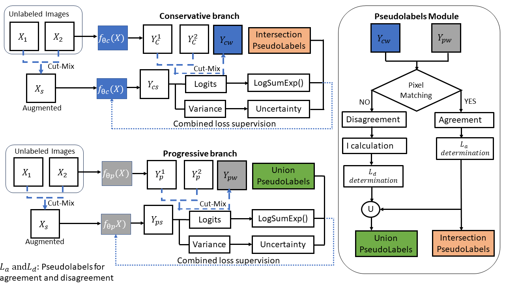

# DUEB: Uncertainty and Energy based Loss Guided Semi-Supervised Semantic Segmentation



> For technical details, please refer to:
>
> [Uncertainty and Energy based Loss Guided Semi-Supervised Semantic Segmentation](https://doi.org/10.48550/arXiv.2501.01640)

## (0) Abstract

Semi-supervised (SS) semantic segmentation exploits both labeled and unlabeled images to overcome tedious and costly pixel-level annotation problems. Pseudolabel supervision is one of the core approaches of training networks with both pseudo labels and ground-truth labels. This work uses aleatoric or data uncertainty and energy based modeling in intersection-union pseudo supervised network.The aleatoric uncertainty is modeling the inherent noise variations of the data in a network with two predictive branches. The per-pixel variance parameter obtained from the network gives a quantitative idea about the data uncertainty. Moreover, energy-based loss realizes the potential of generative modeling on the downstream SS segmentation task. The aleatoric and energy loss are applied in conjunction with pseudo-intersection labels, pseudo-union labels, and ground-truth on the respective network branch. The comparative analysis with state-of-the-art methods has shown improvement in performance metrics.


## (1) Setup

This code has been tested with Python 3.6, PyTorch 1.0.0 on Ubuntu 18.04.

* Setup the environment
  ```bash
  conda create -n CPCL python=3.6
  source activate CPCL
  conda install pytorch==1.0.0 torchvision==0.2.2
  ```

* Clone the repository

* Install the requirements
  ```bash
  pip install -r requirements.txt
  ```
* Download the ResNet-50/ResNet-101 for training and move it to ./DATA/pytorch-weight/
  
      | Model                    | Baidu Cloud  |
      |--------------------------|--------------|
      | ResNet-50                | [Download](https://pan.baidu.com/s/1agsf6BSvmVVGTvk23JXxaw): skrv |
      | ResNet-101               | [Download](https://pan.baidu.com/s/1PLg22P_Nv9GwR-KEzGdvTA): 0g8u |

## (2) Cityscapes

* Data preparation
  
  Download the "city.zip" followed [CPS](https://pkueducn-my.sharepoint.com/personal/pkucxk_pku_edu_cn/_layouts/15/onedrive.aspx?id=%2Fpersonal%2Fpkucxk%5Fpku%5Fedu%5Fcn%2FDocuments%2FDATA&ga=1), and move the upcompressed folder to ./DATA/city

* Modify the configuration in [config.py](./exp_city/config.py)
  * Setup the path to the DUEB in line 24
    ```python
    C.volna = '/data3/DUEB-main_copyR/'
    ```
  * [**Optional**] Modify the data partitions in line 62 & 63 to try partitions beside 1/8

    ```python
    C.labeled_ratio = 8
    C.nepochs = 137
    ```
    > The recommended nepochs for batch_size=16 corresponding to the labeled_ratio are listed as below
    > | Dataset    | 1/16 | 1/8  | 1/4  | 1/2  |
    > | ---------- | ---- | ---- | ---- | ---- |
    > | Cityscapes | 128  | 137  | 160  | 240  |
  
* Training
  ```bash
  cd exp_city
  python train.py 
  #train with only data uncertainty loss 
  python trainal.py
  #train with only energy loss 
  python traine.py 
  ```
  > If you meet *ImportError: libmkldnn.so.0: undefined symbol: cblas_sgemm_alloc*
  >
  > Here is a possible solution: conda install mkl=2018 -c anaconda

* Evaluation
  ```bash
  cd exp_city
  python eval.py -e $model.pth -d $GPU-ID
  # add argument -s to save demo images
  python eval.py -e $model.pth -d $GPU-ID -s
  ```
  > There are four evaluation modes:
  > 1. Only eval a .pth model: -e *.pth
  > 2. Only eval a certain epoch: -e epoch
  > 3. Eval all epochs in a given section: -e start_epoch-end_epoch
  > 4. Eval all epochs from a certain started epoch: -e start_epoch-


## (3) PascalVOC

* Data preparation
  
  Download the "pascal_voc.zip" at [BaiduCloud](https://pan.baidu.com/s/1x86kqXAFU9q3-lYPFN_7dw): o9b3, and move the upcompressed folder to ./DATA/pascal_voc

* Modify the configuration in [config.py](./exp_voc/config.py)
  * Setup the path to the CPCL in line 25
    ```python
    C.volna = '/data3/DUEB-main_copyR/'
    ```
  * [**Optional**] Modify the data partitions in line 62 & 63 to try partitions beside 1/8

    

    ```python
    C.labeled_ratio = 8
    C.nepochs = 34
    ```
    > The recommended nepochs for batch_size=8 corresponding to the labeled_ratio are listed as below
    > | Dataset    | 1/16 | 1/8  | 1/4  | 1/2  |
    > | ---------- | ---- | ---- | ---- | ---- |
    > | PascalVOC  | 32   | 34   | 40   | 60   |
  *  [**Optional**] Modify the dataset sources in line 62-67 for few-supervision experiments 

       

       ```python
       C.labeled_ratio = 8
       C.nepochs = 34
       C.train_source = osp.join(C.dataset_path, 'subset_train_aug/train_pseudoseg_labeled_1-{}.txt'.format(C.labeled_ratio))
       C.unsup_source = osp.join(C.dataset_path, 'train_aug.txt')
       ```
  *  [**Optional**] Modify the dataset sources in line 66 & 67 for full-supervision experiments 

       ```python
       C.train_source = osp.join(C.dataset_path,'train.txt')
       C.unsup_source = osp.join(C.dataset_path, 'train_aug.txt')
       ```
  
* Training
  ```bash
  cd exp_voc
  python train.py
  #train with only data uncertainty loss 
  python trainal.py
  #train with only energy loss 
  python traine.py 
  ```
  > If you meet *ImportError: libmkldnn.so.0: undefined symbol: cblas_sgemm_alloc*
  >
  > Here is a possible solution: conda install mkl=2018 -c anaconda

* Evaluation
  ```bash
  cd exp_voc
  python eval.py -e $model.pth -d $GPU-ID
  ```

## Citation

If you find our work useful in your research, please consider citing:

```
@ARTICLE{10042237,
 @InProceedings{DUEB_WACV2025,
  author    = {Thakur, Rini Smita, and Kurmi, Vinod k},
  title     = {Uncertainty and Energy based Loss Guided Semi-Supervised Semantic Segmentation},
  booktitle = {IEEE/CVF Winter Conference on Applications of Computer Vision (WACV)},
  year      = {2025},
}
```

### Acknowledgment

Part of our code refers to the work [CPS](https://github.com/charlesCXK/TorchSemiSeg)
Part of our code refers to the work [CPCL](https://github.com/leofansq/CPCL)

